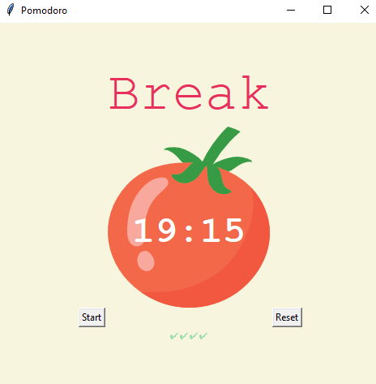

# 🍅**Pomodoro Timer**⏳

This is a Pomodoro Timer application built using Python and the Tkinter library. The Pomodoro Technique is a time management method developed by **Francesco Cirillo** in the late 1980s. It uses a timer to break work into intervals, traditionally 25 minutes in length, separated by short breaks.

## Features 

- Set the duration for work sessions, short breaks, and long breaks.
- Start the timer and switch between work sessions and breaks automatically.
- Reset the timer to its initial state.
- Keep track of completed work sessions with checkmarks.
- Attractive user interface with a tomato image representing the timer.

## How to Use

1. Install Python and ensure that Tkinter is available.
2. Copy the code into a Python file.
3. Run the Python file.
4. The Pomodoro Timer window will open.
5. Click the "Start" button to begin the timer.
6. The timer will switch between work sessions and breaks automatically.
7. Click the "Reset" button to stop the timer and reset it.
8. The checkmarks will indicate completed work sessions.

## Customization

Feel free to customize the Pomodoro Timer according to your specific requirements. You can make the following changes to the code:

- Adjust the durations for work sessions, short breaks, and long breaks by modifying the values of `WORK_MIN`, `SHORT_BREAK_MIN`, and `LONG_BREAK_MIN` constants, respectively.
- Update the colors used in the application by changing the values of `PINK`, `RED`, `GREEN`, and `YELLOW` constants.
- Modify the font style and size by updating the `FONT_NAME` constant.

